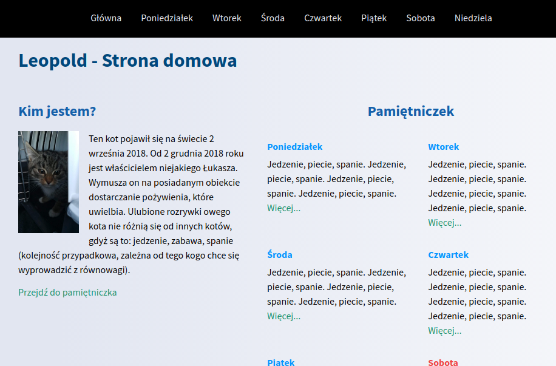

# Simple page with [my cat Leopold](https://sokolx.github.io/homepage-gulp/)

## Tehnologies and tools used in this project:
- HTML5
- CSS3 
    - flexbox 
    - GRID
    - Sass (scss syntax)
- GULP
- GIT
- Node.js / NPM
- Visual Studio Code